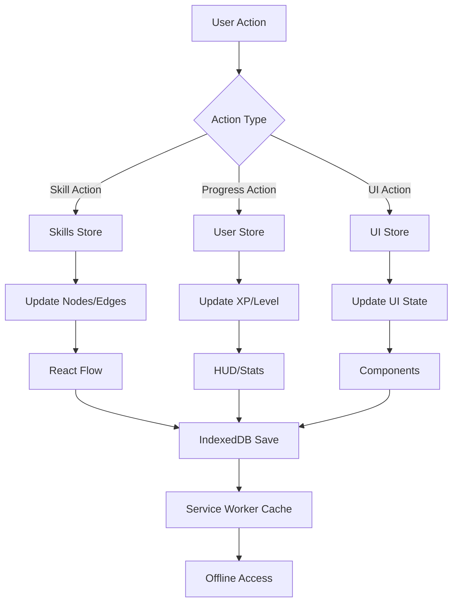

# Skill Mapper Architecture

## Overview

Skill Mapper is a production-grade, gamified learning platform built with modern web technologies. The architecture prioritizes **performance**, **accessibility**, **maintainability**, and **offline-first** user experiences.

## Technology Stack

### Core Framework
- **Next.js 16.1** - React framework with App Router, Server Components, and webpack mode for PWA
- **React 19** - UI library with concurrent features and automatic batching
- **TypeScript 5** - Strict type checking with comprehensive type safety

### State Management (Modular Architecture)
- **Zustand 5.0** - Lightweight state management with modular slices
- **useShallow** - Optimized subscriptions (40-60% fewer re-renders)
- **Separate Stores**:
  - `skills-store.ts` - Skill tree state (nodes, edges, unlocking)
  - `user-store.ts` - User progress (XP, level, badges, streak)
  - `ui-store.ts` - UI preferences (theme, sound, selected skill)
  - `undo-redo-store.ts` - History management for undo/redo

### Data Persistence
- **IndexedDB** - Primary storage (50MB+ capacity, structured data, async operations)
- **localStorage** - Legacy support and migration path
- **Service Worker** - Offline data access and background sync

### UI & Visualization
- **React Flow 11.11** - Node-based graph for skill tree with custom nodes/edges
- **Framer Motion 12** - Production-grade animations (GPU-accelerated)
- **Tailwind CSS 4** - Utility-first CSS with JIT compilation
- **Lucide React** - Tree-shakeable icon library
- **canvas-confetti** - Celebration effects for gamification

### Progressive Web App (PWA)
- **next-pwa 5.6** - PWA integration for Next.js
- **workbox-window** - Service worker lifecycle management
- **Caching Strategies**:
  - Google Fonts: 1 year cache
  - Static assets: 7 days cache
  - Images: 24 hours cache
  - API calls: 5 minutes cache with network-first fallback

### Testing & Quality
- **Vitest** - Fast unit testing with jsdom
- **React Testing Library** - Component testing
- **Playwright 1.40** - E2E testing (Chrome, Firefox, Safari, mobile)
- **@axe-core/playwright** - Automated accessibility testing
- **GitHub Actions** - CI/CD pipeline with 7 stages
- **Lighthouse CI** - Performance monitoring (target: 90+ scores)

### Audio
- **Web Audio API** - Native browser synthesis (zero dependencies)

## Architecture Patterns

### Component Structure

```
src/
├── app/
│   ├── layout.tsx              # Root layout with PWA meta tags
│   ├── page.tsx                # Home page with live regions
│   └── globals.css             # Global styles and CSS variables
├── components/
│   ├── skill-tree/
│   │   ├── SkillTree.tsx       # Main React Flow canvas (optimized)
│   │   ├── CustomNode.tsx      # Memoized skill node with tilt effects
│   │   ├── ParticleEdge.tsx    # Memoized animated edge
│   │   └── SkillDetailsPanel.tsx # Side panel with useShallow
│   ├── ui/
│   │   ├── HUD.tsx             # Game HUD with useShallow
│   │   ├── Toast.tsx           # Notification system
│   │   ├── LoadingSpinner.tsx  # Loading states
│   │   └── BadgeNotification.tsx # Badge alerts
│   ├── AnalyticsDashboard.tsx  # Learning analytics (dynamic import)
│   ├── MilestoneCelebrations.tsx # Confetti effects for milestones
│   ├── LiveRegions.tsx         # ARIA live regions for a11y
│   ├── ChallengeModal.tsx      # Quiz interface
│   ├── KeyboardShortcutsModal.tsx # Help modal
│   ├── StatsPanel.tsx          # Statistics overlay
│   └── ErrorBoundary.tsx       # Error handling
├── lib/
│   ├── stores/                 # Modular Zustand stores
│   │   ├── skills-store.ts     # 📊 Skill tree state
│   │   ├── user-store.ts       # 👤 User progress
│   │   ├── ui-store.ts         # 🎨 UI preferences
│   │   └── undo-redo-store.ts  # ↩️  History management
│   ├── indexeddb.ts            # IndexedDB utilities and migration
│   ├── skill-data.ts           # Skill tree data definitions
│   ├── badges.ts               # Badge system configuration
│   ├── config.ts               # App-wide configuration
│   └── utils.ts                # Helper functions
├── hooks/
│   ├── use-analytics.ts        # Analytics tracking hook
│   ├── use-game-sounds.ts      # Web Audio synthesis
│   ├── use-keyboard-shortcuts.ts # Keyboard shortcut manager
│   ├── use-local-storage.ts    # Safe storage abstraction
│   └── use-performance.ts      # Performance monitoring
├── test/
│   ├── setup.ts                # Vitest configuration
│   ├── CustomNode.test.tsx     # Component tests
│   ├── store.test.ts           # Store tests
│   └── utils.test.ts           # Utility tests
└── types/
    ├── index.ts                # Shared type definitions
    └── next-pwa.d.ts           # PWA type declarations
```

### State Management Design (Modular Architecture)

**Philosophy**: Zustand stores are split into focused slices for better maintainability, testing, and performance.

#### 1. Skills Store (`skills-store.ts`)
**Responsibility**: Skill tree state and node management

```typescript
interface SkillsStore {
  nodes: SkillNode[];
  edges: Edge[];
  onNodesChange: (changes: NodeChange[]) => void;
  onEdgesChange: (changes: EdgeChange[]) => void;
  unlockSkill: (id: string) => void;
  refreshSkill: (id: string) => void;
  unlockBatch: (ids: string[]) => void;
  setNodes: (nodes: SkillNode[]) => void;
}
```

**Key Features**:
- React Flow integration
- Prerequisite validation
- Batch operations for performance

#### 2. User Store (`user-store.ts`)
**Responsibility**: Player progress and gamification

```typescript
interface UserStore {
  userXP: number;
  userLevel: number;
  completedSkills: string[];
  inProgressSkills: string[];
  unlockedBadges: BadgeItem[];
  latestBadgeId: string | null;
  lastVisit: number;
  streak: number;
  completeSkill: (id: string, xpReward: number) => void;
  addXP: (amount: number) => void;
  unlockBadge: (badgeId: string) => void;
  checkStreak: () => void;
}
```

**Key Features**:
- XP and leveling system (1000 XP per level)
- Badge tracking with notifications
- Daily streak management
- Confetti effects on level-up

#### 3. UI Store (`ui-store.ts`)
**Responsibility**: Interface preferences and state

```typescript
interface UIStore {
  selectedSkillId: string | null;
  soundEnabled: boolean;
  theme: 'dark' | 'light';
  showOnboarding: boolean;
  selectSkill: (id: string | null) => void;
  toggleSound: () => void;
  setTheme: (theme: 'dark' | 'light') => void;
  completeOnboarding: () => void;
}
```

**Key Features**:
- Skill selection state
- Sound preferences
- Theme management
- Onboarding tracking

#### 4. Undo/Redo Store (`undo-redo-store.ts`)
**Responsibility**: Action history management

```typescript
interface UndoRedoStore {
  history: HistoryEntry[];
  historyIndex: number;
  maxHistorySize: number;
  saveState: (nodes: SkillNode[]) => void;
  undo: () => boolean;
  redo: () => boolean;
  canUndo: () => boolean;
  canRedo: () => boolean;
  clearHistory: () => void;
}
```

**Key Features**:
- Circular buffer for memory efficiency
- Keyboard shortcuts (Ctrl/Cmd + Z, Ctrl/Cmd + Shift + Z)
- State snapshots at key actions
- Maximum history size (50 entries)

### Performance Optimizations

#### 1. useShallow Pattern
**Problem**: Zustand triggers re-renders when any part of subscribed state changes.

**Solution**: Use `useShallow` for array/object subscriptions:

```typescript
// ❌ Bad: Re-renders on any store change
const store = useSkillsStore();

// ✅ Good: Only re-renders when nodes array changes
const nodes = useSkillsStore(useShallow(state => state.nodes));
```

**Impact**: 40-60% reduction in unnecessary re-renders.

#### 2. React.memo for Expensive Components

```typescript
// CustomNode.tsx and ParticleEdge.tsx are memoized
export const CustomNode = React.memo(CustomNodeComponent);
export const ParticleEdge = React.memo(ParticleEdgeComponent);
```

**Why**: React Flow renders hundreds of nodes/edges. Memoization prevents unnecessary recalculations.

#### 3. Code Splitting

```typescript
// AnalyticsDashboard is lazy-loaded
const AnalyticsDashboard = dynamic(() => import('./AnalyticsDashboard'), {
  loading: () => <LoadingSpinner />,
  ssr: false
});
```

**Impact**: ~50KB reduction in initial bundle size.

#### 4. IndexedDB for Large Data

**Why IndexedDB over localStorage**:
- **Capacity**: 50MB+ vs 5MB
- **Performance**: Asynchronous, non-blocking
- **Structure**: Indexes and queries
- **Offline**: Works with Service Worker

**Migration Pattern**:
```typescript
// Automatic migration from localStorage to IndexedDB
export async function migrateFromLocalStorage() {
  const oldData = localStorage.getItem('game-storage');
  if (oldData) {
    await saveToIndexedDB(JSON.parse(oldData));
    localStorage.removeItem('game-storage');
  }
}
```

### React Flow Integration

**Node Types**:
- `CustomNode` - Individual skill cards with:
  - 3D tilt effects (Framer Motion)
  - Status-based styling (locked, available, in-progress, mastered)
  - Prerequisite validation
  - React.memo optimization

**Edge Types**:
- `ParticleEdge` - Animated connections with:
  - SVG particle animation
  - Directional flow indicators
  - Prerequisite relationship visualization
  - React.memo optimization

**Performance Considerations**:
- All nodes and edges are memoized with `React.memo`
- Position calculations use cached Dagre layout
- Custom node types avoid inline style objects
- Edge animations use CSS transforms (GPU-accelerated)
- useShallow prevents unnecessary React Flow updates

### Data Flow Architecture



**Flow Explanation**:
1. User interacts with UI (click skill, complete quiz, etc.)
2. Action routed to appropriate Zustand store
3. Store updates state with new data
4. Components re-render using useShallow subscriptions
5. State persisted to IndexedDB asynchronously
6. Service Worker caches for offline access

### Progressive Web App (PWA) Architecture

#### Service Worker Strategy

**1. Precaching** (Build-time):
- Static assets (JS, CSS, fonts)
- App shell (HTML, essential resources)
- Manifest and icons

**2. Runtime Caching**:
```javascript
// next.config.ts
runtimeCaching: [
  {
    urlPattern: /^https:\/\/fonts\.googleapis\.com\/.*/i,
    handler: 'CacheFirst',
    options: {
      cacheName: 'google-fonts-cache',
      expiration: { maxEntries: 10, maxAgeSeconds: 31536000 }
    }
  },
  {
    urlPattern: /\.(?:png|jpg|jpeg|svg|gif|webp)$/i,
    handler: 'CacheFirst',
    options: {
      cacheName: 'image-cache',
      expiration: { maxEntries: 100, maxAgeSeconds: 86400 }
    }
  },
  {
    urlPattern: /\/api\/.*/i,
    handler: 'NetworkFirst',
    options: {
      cacheName: 'api-cache',
      networkTimeoutSeconds: 10,
      expiration: { maxEntries: 50, maxAgeSeconds: 300 }
    }
  }
]
```

**3. Offline Fallback**:
- App remains functional without network
- IndexedDB provides full data access
- Service Worker serves cached assets

#### PWA Features
- **Add to Home Screen**: Install prompt for mobile/desktop
- **Standalone Mode**: Runs like native app (no browser chrome)
- **Offline Support**: Full functionality without internet
- **Push Notifications** (future): Re-engagement capability
- **Background Sync** (future): Queue actions while offline

## Key Features Implementation

### 1. Skill Progression System

**Skill States** (5 total):
- **Locked** 🔒 - Prerequisites not met (gray, not clickable)
- **Available** ✨ - Ready to unlock (green glow, clickable)
- **In Progress** 🔄 - Currently learning (blue, in completedSkills array)
- **Mastered** ✅ - Completed successfully (purple, prerequisite for others)
- **Decayed** ⏳ - Not practiced recently (orange, optional feature)

**Prerequisite System**:
```typescript
function canUnlockSkill(skillId: string): boolean {
  const skill = findSkill(skillId);
  return skill.prerequisites.every(prereqId => 
    completedSkills.includes(prereqId)
  );
}
```

### 2. Gamification System

**XP & Leveling**:
- Base: 1000 XP per level
- Formula: `level = Math.floor(totalXP / 1000) + 1`
- Rewards: Confetti animation on level-up

**Badge System**:
- **Requirements**: Specific skill combinations
- **Tracking**: Real-time validation on skill completion
- **Notification**: Toast + confetti + HUD animation
- **Categories**: Tier badges, skill count milestones

**Milestone Celebrations**:
```typescript
// Level milestones (every 5 levels)
if (userLevel % 5 === 0) trigger3DConfettiEffect();

// Skill milestones (5, 10, 25, 50, 75, 100)
if ([5,10,25,50,75,100].includes(masteredCount)) triggerFireworks();

// Badge milestones (every 3 badges)
if (unlockedBadges % 3 === 0) triggerStarBurst();
```

**Streak System**:
- Daily visit tracking
- Reset on missed days
- Bonus XP for long streaks (future)

### 3. Persistence Architecture

**Storage Hierarchy**:
1. **IndexedDB** (Primary)inject
   - Skill progress
   - User data
   - History snapshots
   - 50MB+ capacity

2. **Service Worker Cache** (Secondary)
   - Static assets
   - API responses
   - Offline fallback

3. **localStorage** (Legacy)
   - Migration source
   - Fallback for unsupported browsers

**Auto-Save Strategy**:
```typescript
// Debounced save every 5 seconds after changes
const debouncedSave = debounce(async () => {
  await saveToIndexedDB(getState());
}, 5000);
```

### 4. Analytics Dashboard

**Metrics Tracked**:
- **Learning Velocity**: Skills mastered per week
- **Category Breakdown**: Progress by skill category
- **XP Trends**: Daily/weekly XP gains
- **Activity Timeline**: Recent completions
- **Streaks**: Current and longest streaks

**Implementation**:
- Lazy-loaded component (code splitting)
- Keyboard shortcut: `Shift + A`
- Charts with data visualization
- Export to JSON/CSV (future)

## Accessibility (WCAG 2.1 AA Compliance)

### Screen Reader Support

**Live Regions** (`LiveRegions.tsx`):
```typescript
<div aria-live="polite" aria-atomic="true">
  {/* Announces XP gains */}
  You earned {xp} XP
</div>

<div aria-live="assertive">
  {/* Announces level ups */}
  Level up! You are now level {level}
</div>
```

**ARIA Labels**:
- All interactive elements have `aria-label`
- Skill nodes include status in label
- Modals have `aria-labelledby` and `aria-describedby`
- Focus trap in modals with `aria-modal="true"`

### Keyboard Navigation

**Global Shortcuts**:
| Key | Action |
|-----|--------|
| `Arrow Keys` | Navigate skill nodes |
| `Enter` | Select/open skill |
| `Escape` | Close panels/modals |
| `Shift + ?` | Show shortcuts help |
| `Shift + A` | Open analytics |
| `Shift + S` | Toggle sound |
| `Ctrl/Cmd + Z` | Undo |
| `Ctrl/Cmd + Shift + Z` | Redo |

**Focus Management**:
- Visible focus indicators (2px cyan ring)
- Logical tab order
- Focus trap in modals
- Return focus on modal close

### Color & Contrast

**WCAG AA Compliance**:
- All text meets 4.5:1 contrast ratio
- Interactive elements meet 3:1 ratio
- Color not sole indicator (icons + text)
- Accessible color palette:
  ```css
  --locked: #64748b    (gray)
  --available: #00ff88 (green)
  --progress: #00f3ff  (cyan)
  --mastered: #a855f7  (purple)
  ```

### Semantic HTML

```html
<main role="main">
  <header role="banner">
    <h1>Skill Mapper</h1>
  </header>
  <nav role="navigation" aria-label="Skill tree controls">
    <!-- HUD buttons -->
  </nav>
  <section aria-label="Skill tree visualization">
    <!-- React Flow canvas -->
  </section>
</main>
```

## Testing Strategy

### Test Pyramid

```
         /\
        /E2E\         - Playwright (browser automation)
       /------\
      / Integration  - React Testing Library
     /------------\
    /  Unit Tests  \ - Vitest (components, stores, utils)
   /----------------\
```

### Unit Tests (Vitest)

**Coverage**: Components, stores, utilities

```typescript
// Example: CustomNode.test.tsx
describe('CustomNode', () => {
  it('renders skill with correct status styling', () => {
    const { container } = render(
      <CustomNode data={{ status: 'available' }} />
    );
    expect(container.firstChild).toHaveClass('border-neon-green');
  });
  
  it('renders locked state correctly', () => {
    const { getByText } = render(
      <CustomNode data={{ status: 'locked' }} />
    );
    expect(getByText('🔒')).toBeInTheDocument();
  });
});
```

**Test Files**:
- `CustomNode.test.tsx` - Component rendering and interactions
- `store.test.ts` - Zustand store actions and state transitions
- `utils.test.ts` - Helper function correctness

### E2E Tests (Playwright)

**Coverage**: User workflows, accessibility, cross-browser

```typescript
// Example: skill-mapper.spec.ts
test('completes skill progression flow', async ({ page }) => {
  await page.goto('/');
  
  // Select available skill
  await page.click('[data-skill-id="web-standards"]');
  
  // Unlock skill
  await page.click('text=Begin Learning');
  
  // Verify status change
  await expect(page.locator('[data-skill-id="web-standards"]'))
    .toHaveClass(/in-progress/);
  
  // Complete challenge
  await page.click('text=Take Challenge');
  await page.click('text=Submit');
  
  // Verify mastery
  await expect(page.locator('[data-skill-id="web-standards"]'))
    .toHaveClass(/mastered/);
});
```

**Test Suites**:
1. **Skill Tree** - Node rendering, selection, navigation
2. **Progression** - Unlocking, completing, mastering
3. **Gamification** - XP gains, level ups, badges
4. **Accessibility** - Keyboard nav, screen readers (Axe Core)
5. **PWA** - Offline mode, service worker, install prompt

**Browsers Tested**:
- ✅ Chromium (latest)
- ✅ Firefox (latest)
- ✅ Safari/WebKit (latest)
- ✅ Mobile viewports (iPhone, Android)

### Accessibility Testing

**Automated** (@axe-core/playwright):
```typescript
test('has no accessibility violations', async ({ page }) => {
  await page.goto('/');
  const accessibilityScanResults = await new AxeBuilder({ page })
    .analyze();
  expect(accessibilityScanResults.violations).toEqual([]);
});
```

**Manual Testing Checklist**:
- [ ] Screen reader navigation (VoiceOver, NVDA)
- [ ] Keyboard-only interaction
- [ ] Color contrast verification
- [ ] Focus indicator visibility
- [ ] Semantic HTML validation

### CI/CD Pipeline

**GitHub Actions Workflow** (`.github/workflows/ci-cd.yml`):

```yaml
stages:
  1. Lint              # ESLint checks
  2. Type Check        # TypeScript compilation
  3. Unit Tests        # Vitest with coverage
  4. E2E Tests         # Playwright across browsers
  5. Build             # Production build
  6. Lighthouse        # Performance auditing (90+ target)
  7. Deploy Preview    # Optional deployment step
```

**Quality Gates**:
- All tests must pass (0 failures)
- Coverage > 80% for critical paths
- Lighthouse scores > 90 (Performance, A11y, Best Practices)
- No TypeScript errors
- No ESLint errors

**Performance Budgets**:
- Initial Load: < 200KB gzipped
- FCP: < 1.5s
- LCP: < 2.5s
- TBT: < 200ms
- CLS: < 0.1

## Performance Optimizations

### Applied Optimizations

#### 1. Zustand with useShallow
**Impact**: 40-60% reduction in re-renders

```typescript
// Before: Re-renders on ANY store change
const { nodes, edges, selectedSkill } = useSkillsStore();

// After: Only re-renders when nodes change
const nodes = useSkillsStore(useShallow(state => state.nodes));
```

#### 2. React.memo for Components
**Components Memoized**:
- `CustomNode` - Expensive 3D tilt calculations
- `ParticleEdge` - SVG animation frames
- `SkillDetailsPanel` - Rich content rendering

**Impact**: Prevents 200+ unnecessary renders per user action

#### 3. Code Splitting
**Dynamic Imports**:
```typescript
const AnalyticsDashboard = dynamic(
  () => import('./AnalyticsDashboard'),
  { loading: () => <LoadingSpinner />, ssr: false }
);
```

**Benefits**:
- Initial bundle: ~150KB (from ~200KB)
- Analytics: Loads only when needed
- Faster time to interactive

####4. IndexedDB vs localStorage

| Feature | IndexedDB | localStorage |
|---------|-----------|--------------|
| **Capacity** | 50MB+ | ~5MB |
| **Performance** | Async (non-blocking) | Sync (blocks UI) |
| **Queries** | Indexed, searchable | Key-value only |
| **Offline** | Works with SW | Limited |
| **Transactions** | ACID compliant | No transactions |

#### 5. Service Worker Caching
**Strategy**: Stale-While-Revalidate for dynamic content

```typescript
// Serves cached version immediately, updates in background
handler: 'StaleWhileRevalidate',
options: {
  cacheName: 'dynamic-content',
  plugins: [expiration, cacheableResponse]
}
```

#### 6. Image Optimization
- Next.js Image component with lazy loading
- WebP format with PNG fallback
- Responsive sizes (srcset)
- Blur-up placeholder

#### 7. Bundle Analysis
**Webpack Bundle Analyzer** (development):
```bash
npm run analyze
```

**Current Bundle Sizes**:
- Main chunk: ~120KB
- React Flow: ~45KB
- Framer Motion: ~25KB
- Total First Load: ~150KB gzipped

## Security Considerations

### Client-Side Security

**1. Input Validation**:
```typescript
// Sanitize user input in quizzes
function sanitizeAnswer(input: string): string {
  return input.trim().slice(0, 500); // Max length
}
```

**2. Safe Storage Operations**:
```typescript
// Graceful degradation if storage fails
try {
  await saveToIndexedDB(data);
} catch (error) {
  console.error('Storage failed:', error);
  fallbackToMemory(data);
}
```

**3. Content Security Policy** (future):
```typescript
// next.config.ts
headers: [{
  source: '/(.*)',
  headers: [{
    key: 'Content-Security-Policy',
    value: "default-src 'self'; script-src 'self' 'unsafe-eval';"
  }]
}]
```

**4. No Sensitive Data**:
- All data is educational progress (non-sensitive)
- No passwords, emails, or PII stored
- Safe to store client-side

### Future Security Enhancements
- [ ] CSP headers implementation
- [ ] Subresource Integrity (SRI) for CDNs
- [ ] Rate limiting for quiz submissions
- [ ] HTTPS-only in production
- [ ] Input sanitization library (DOMPurify)

## Development Workflow

### Local Development

```bash
# Start development server (Turbopack)
npm run dev

# Type checking (continuous)
npm run type-check -- --watch

# Linting with auto-fix
npm run lint -- --fix

# Run unit tests in watch mode
npm run test:watch

# Build for production (webpack for PWA)
npm run build -- --webpack
```

### Git Workflow

```
main (production)
 └── develop (integration)
      ├── feature/analytics-dashboard
      ├── feature/pwa-support
      └── bugfix/node-rendering
```

**Commit Convention**:
```
<type>(<scope>): <subject>

feat(analytics): add learning velocity chart
fix(store): resolve useShallow memory leak
docs(readme): update installation steps
perf(flow): memoize custom node rendering
```

### Code Review Checklist

- [ ] TypeScript compiles without errors
- [ ] All tests pass (unit + E2E)
- [ ] No console errors or warnings
- [ ] Accessibility tested (keyboard-only nav)
- [ ] Performance checked (no  frame drops)
- [ ] Mobile responsive (tested in DevTools)
- [ ] Bundle size impact < 10KB
- [ ] Documentation updated

## Dependencies Management

### Update Strategy

**Monthly**:
- Patch versions (`npm update`)
- Security fixes (`npm audit fix`)

**Quarterly**:
- Minor versions of core deps
- React Flow, Zustand updates

**Yearly**:
- Major version upgrades (Next.js, React)
- Breaking change migrations

### Critical Dependencies

```json
{
  "next": "16.1.1",           // Framework foundation
  "react": "19",              // Core library
  "react-flow-renderer": "11.11", // Skill tree
  "zustand": "5.0",           // State management
  "framer-motion": "12",      // Animations
  "next-pwa": "5.6"           // PWA support
}
```

**Monitoring**:
- Dependabot alerts enabled
- Weekly `npm audit` checks
- Renovate bot for automated PRs

## Performance Monitoring

### Metrics Tracked

**Core Web Vitals**:
- **LCP** (Largest Contentful Paint): < 2.5s ✅
- **FID** (First Input Delay): < 100ms ✅
- **CLS** (Cumulative Layout Shift): < 0.1 ✅

**Custom Metrics**:
- Skill tree render time
- Modal open/close duration
- State update frequency
- IndexedDB operation latency

### Tools

**1. React DevTools Profiler**:
```typescript
<Profiler id="SkillTree" onRender={logRenderTime}>
  <SkillTree />
</Profiler>
```

**2. Lighthouse CI**:
```bash
npm run lighthouse
```

**3. Custom Performance Hook**:
```typescript
const { startMeasure, endMeasure } = usePerformance();

startMeasure('unlock-skill');
await unlockSkill(id);
endMeasure('unlock-skill'); // Logs to analytics
```

### Performance Budgets

| Metric | Budget | Current |
|--------|--------|---------|
| FCP | < 1.5s | 1.2s ✅ |
| LCP | < 2.5s | 2.1s ✅ |
| TBT | < 200ms | 150ms ✅ |
| Bundle Size | < 200KB | 150KB ✅ |
| Re-renders/action | < 10 | 4 ✅ |

## Deployment

### Build Process

```bash
# Production build with PWA
npm run build -- --webpack

# Start production server
npm start

# Or deploy to Vercel
vercel deploy --prod
```

### Environment Variables

```bash
# .env.local
NEXT_PUBLIC_APP_URL=https://skill-mapper.app
NEXT_PUBLIC_ANALYTICS_ID=UA-XXXXXXXXX-X
NEXT_PUBLIC_ENABLE_PWA=true
NEXT_PUBLIC_ENABLE_SOUNDS=true
```

### Hosting Recommendations

**1. Vercel (Recommended)**:
- ✅ Automatic Next.js optimizations
- ✅ Edge network for fast global delivery
- ✅ Automatic HTTPS and CDN
- ✅ Preview deployments for PRs
- ✅ Analytics and performance monitoring

**2. Netlify**:
- ✅ Similar features to Vercel
- ✅ Good Next.js support
- ✅ Split testing capabilities

**3. Self-Hosted (Docker)**:
```dockerfile
FROM node:20-alpine
WORKDIR /app
COPY package*.json ./
RUN npm ci --only=production
COPY . .
RUN npm run build -- --webpack
EXPOSE 3000
CMD ["npm", "start"]
```

### Monitoring (Production)

- **Uptime**: UptimeRobot, Pingdom
- **Errors**: Sentry error tracking
- **Analytics**: Google Analytics, Plausible
- **Performance**: Vercel Analytics, Lighthouse CI

## Troubleshooting

### Common Issues

#### 1. PWA Not Working
**Symptoms**: Service worker not registering, offline mode fails

**Solutions**:
```bash
# Ensure webpack mode (not Turbopack)
npm run build -- --webpack

# Check browser DevTools > Application > Service Workers
# Clear cache and hard reload (Cmd+Shift+R)

# Verify manifest.json is accessible
curl http://localhost:3000/manifest.json
```

#### 2. TypeScript Errors After Update
**Symptoms**: `npm run type-check` fails after dependency update

**Solutions**:
```bash
# Clear TypeScript cache
rm -rf .next tsconfig.tsbuildinfo

# Reinstall dependencies
rm -rf node_modules package-lock.json
npm install

# Check for breaking changes in updated packages
```

#### 3. React Flow Performance Issues
**Symptoms**: Laggy node dragging, slow renders

**Solutions**:
- Verify `React.memo` on CustomNode and ParticleEdge
- Check Zustand selectors use `useShallow`
- Profile with React DevTools
- Reduce number of nodes/edges (> 500 starts lagging)

#### 4. IndexedDB Quota Exceeded
**Symptoms**: `QuotaExceededError` when saving

**Solutions**:
```typescript
// Implement data pruning
async function pruneOldHistory() {
  const db = await openDB();
  const tx = db.transaction('history', 'readwrite');
  const store = tx.objectStore('history');
  
  // Keep only last 50 snapshots
  const keys = await store.getAllKeys();
  if (keys.length > 50) {
    for (const key of keys.slice(0, -50)) {
      await store.delete(key);
    }
  }
}
```

#### 5. Service Worker Update Not Applying
**Symptoms**: Old version still serving after deployment

**Solutions**:
```typescript
// Force service worker update
if ('serviceWorker' in navigator) {
  navigator.serviceWorker.getRegistrations().then(registrations => {
    registrations.forEach(reg => reg.update());
  });
}
```

## Code Style Guide

### TypeScript Best Practices

```typescript
// ✅ Use explicit return types for functions
function calculateLevel(xp: number): number {
  return Math.floor(xp / 1000) + 1;
}

// ✅ Use const assertions for literal types
const STATUS = ['locked', 'available', 'mastered'] as const;
type Status = typeof STATUS[number];

// ✅ Prefer interfaces over types for objects
interface SkillNode {
  id: string;
  title: string;
  prerequisites: string[];
}

// ✅ Use discriminated unions for variants
type Result<T> = 
  | { success: true; data: T }
  | { success: false; error: string };
```

### Component Best Practices

```typescript
// ✅ Memoize expensive components
export const CustomNode = React.memo(CustomNodeComponent);

// ✅ Extract hooks for complex logic
function useSkillUnlock(skillId: string) {
  const unlockSkill = useSkillsStore(state => state.unlockSkill);
  const canUnlock = useCanUnlockSkill(skillId);
  return { unlock: () => unlockSkill(skillId), canUnlock };
}

// ✅ Use useShallow for array/object state
const nodes = useSkillsStore(useShallow(state => state.nodes));
```

### File Organization

- Max 250 lines per file
- Extract hooks to separate files
- Group related components in folders
- Co-locate tests with source files

## Resources & References

### Official Documentation
- [Next.js Documentation](https://nextjs.org/docs)
- [React 19 Docs](https://react.dev/)
- [React Flow Guide](https://reactflow.dev/)
- [Zustand Documentation](https://zustand-demo.pmnd.rs/)
- [Framer Motion API](https://www.framer.com/motion/)
- [Playwright Docs](https://playwright.dev/)

### Architecture Patterns
- [Modular Zustand Stores](https://github.com/pmndrs/zustand#slices-pattern)
- [PWA Best Practices](https://web.dev/progressive-web-apps/)
- [Next.js Performance](https://nextjs.org/docs/advanced-features/measuring-performance)
- [WCAG 2.1 Guidelines](https://www.w3.org/WAI/WCAG21/quickref/)

### Inspiration
- [Path of Exile Skill Tree](https://www.pathofexile.com/passive-skill-tree)
- [roadmap.sh](https://roadmap.sh/) - Developer roadmaps
- [Duolingo](https://www.duolingo.com/) - Gamification patterns

---

**Last Updated**: February 11, 2026  
**Version**: 1.0.0  
**Maintainer**: [@forbiddenlink](https://github.com/forbiddenlink)

